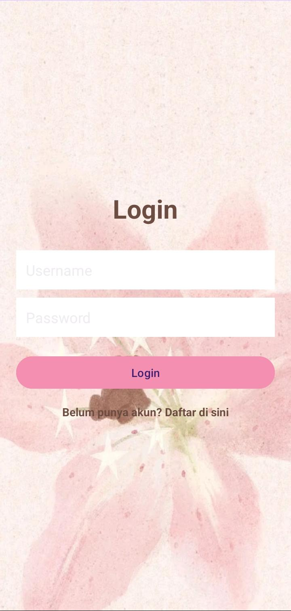
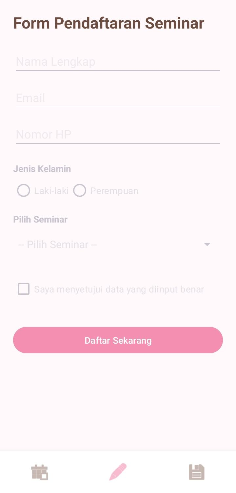
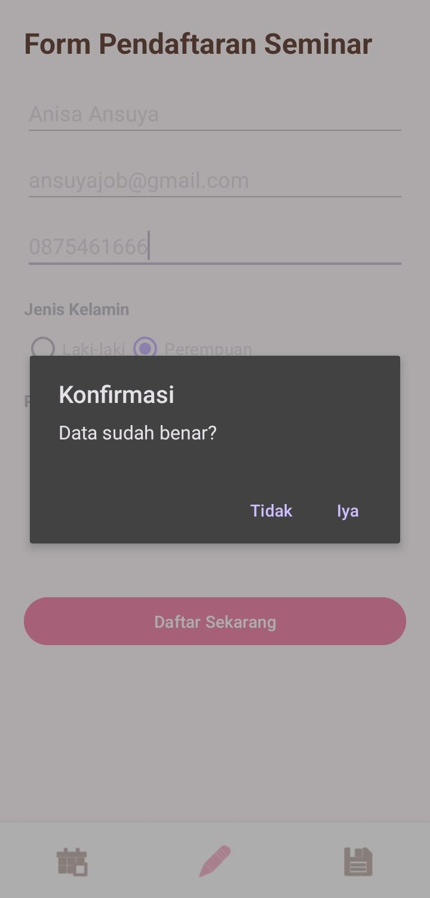
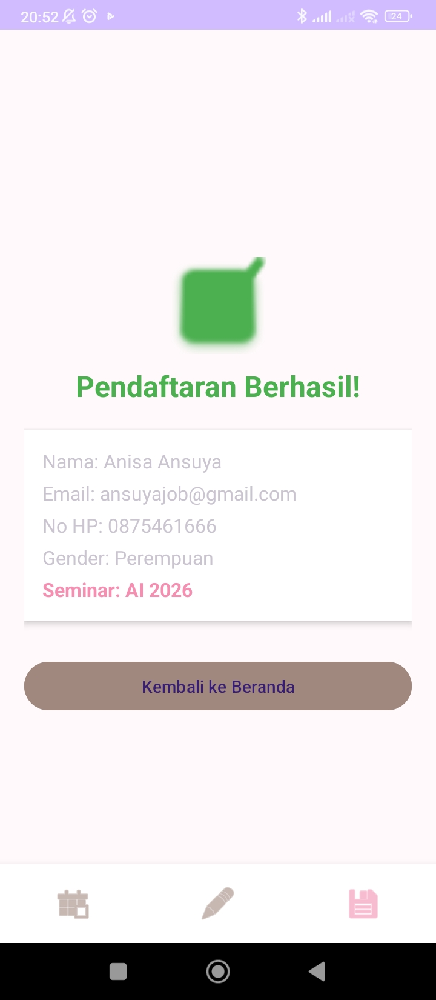

# Seminar Login
The ‘Seminar Login’ app is a simple application designed to make registering for seminars easier. Users (whether participants or organisers) must first log in to enter their details, and the app also offers real-time data validation. With its bear-themed design and soft pink tones, it is specially designed for creators and users who love cute and charming themes.

## Objectives:
- To facilitate seminar registration
- To secure seminar data
- To facilitate participant management
  
## Features
1. Login page
2. Home page
3. Registration form
4. Results display form
5. Navigation bar at the bottom of the registration page

## Screenshot
### Login Page

### Home Page

### Registration form

### Check

### Results display form

## Technologies
- Kotlin
- Android Studio
  
## Contributor
Anisa Ansuya Henna

## YouTube link
https://youtu.be/amiNToMKsYM

